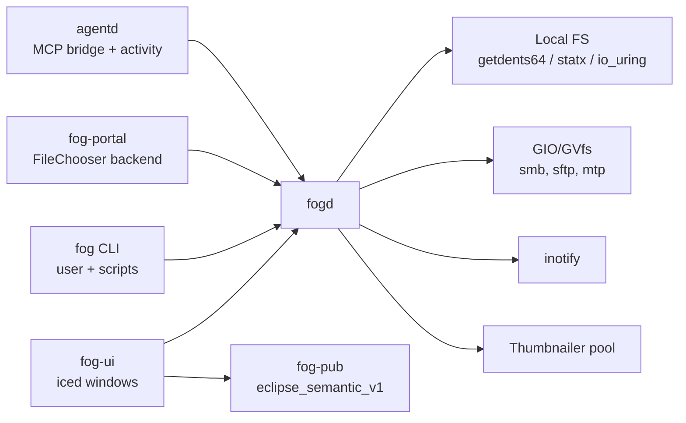
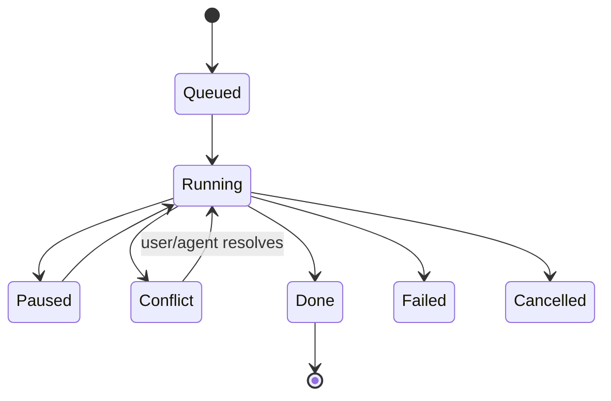

# Fog — Specification

Sep 25, 2026 · Kiel

## Overview

Fog is EclipseOS's native file manager and system file picker. It is a Rust daemon plus an iced UI, dark glass by default, keyboard-first, and configured entirely in KDL. In the agentic install profile it also shows, at a glance, which files agents are working on.

**Goals**

- Feel instant: first frame within one refresh of the keypress. Cached folders paint before the disk is touched.
- Never lose data: every destructive action is undoable or explicitly confirmed.
- One look everywhere: Fog is also the Open/Save dialog for every app, via xdg-desktop-portal.
- Transparent config: every option has a written default in one KDL file. There are no hidden settings.
- Agent-native: agents act through the same undoable pipeline as the user (via `agentd`), and the user can see where agents are working without the agents spending tokens on it.

**Non-goals (v1)**

- Desktop icons or wallpaper management.
- A persistent full-text search index.
- Cross-platform support. Fog targets EclipseOS (Linux, Wayland, the EclipseOS compositor).
- Plugin loading of arbitrary native code.
- Reviewing, diffing or reverting agent edits. Fog shows where agents are working, nothing more.

## Implementation guide

Read this section first. The rest of the spec is the reference.

**Workspace layout** (one Cargo workspace)

```
fog/
  crates/
    fog-proto/      # IPC message types, versioned; no I/O
    fog-daemon/     # fogd binary: backends, cache, watch, jobs, journal, thumbnails
    fog-ui/         # iced app: windows, views, input, animation
    fog-widgets/    # virtual list, glass shader, reusable widgets
    fog-cli/        # `fog` binary
    fog-portal/     # xdg-desktop-portal FileChooser backend
    fog-pub/        # eclipse_semantic_v1 publisher
    fog-elevate/    # polkit-spawned root helper (minimal, audited)
    fog-activity/   # agent views; compiled only with --features activity
    fog-bench/      # latency and frame-time benchmarks
  config/fog.default.kdl
```

**Features**: `gio` (remote backends) and `activity` (agent integration; pulls in `fog-activity` and the `agentd` client). Base builds must compile and pass tests with neither.

**Invariants (never violate)**

- `fogd` never runs with privileges. Only `fog-elevate` runs as root, and only for the lifetime of one elevated tab.
- The UI thread never does filesystem I/O or sorting. All of it happens in `fogd`.
- Every mutation goes through the job queue and the undo journal. No direct writes from the UI, CLI or portal.
- Renames use `RENAME_NOREPLACE`. No code path may silently overwrite a file.
- Unknown config keys are errors, and the last valid config stays active.
- Without the `activity` feature, the binary contains no `agentd` client code.
- Agents never reach `fogd.sock`. Agent calls arrive only via `agentd`.

**Start here: M0**

1. `fog-proto`: `ListDir`, `DirSnapshot`, `DirDiff`, `Stat` messages, length-prefixed framing, version header.
2. `fog-daemon`: `LocalBackend::list` using `getdents64` (phase 1 only), LRU cache, socket server.
3. `fog-ui`: one window, a virtualized list rendering `DirSnapshot` and applying `DirDiff`.
4. `fog-bench`: cold/warm listing for 1k and 10k entries against the budgets in Performance model.

M0 is done when `fog-bench` meets the 1k/10k budgets. Then follow the milestone table in order.

## Architecture

One long-lived daemon, `fogd`, owns all state and I/O. Every other component is a thin client over a Unix socket.



Clients send requests and subscribe to change streams. After the first full listing, `fogd` pushes only diffs.

| Component | Crate | Responsibility |
| --- | --- | --- |
| `fogd` | `fog-daemon` | Directory cache, watching, operation queue, undo journal, thumbnails, mounts, trash |
| `fog-ui` | `fog-ui` | iced frontend: windows, views, input, animation. Holds no authoritative state |
| `fog` | `fog-cli` | Command-line client for the user and user scripts. Not reachable from agent sandboxes |
| `fog-portal` | `fog-portal` | `org.freedesktop.impl.portal.FileChooser` backend. Opens picker windows via `fog-ui` |
| Protocol | `fog-proto` | Shared, versioned message types. serde over length-prefixed frames |
| Publisher | `fog-pub` | Describes Fog's windows (current folder, selection, view) over `eclipse_semantic_v1` (COMP-09) |

Agents never talk to `fogd` directly. `agentd` passes their MCP calls to `fogd` and streams file-activity events to it (see Agent and scripting interface, and Agent activity).

**IPC**

- Socket: `$XDG_RUNTIME_DIR/fog/fogd.sock`, mode 0600. Callers are verified with `SO_PEERCRED`.
- Encoding: length-prefixed frames. Binary (postcard or bincode) for UI traffic, JSON for the CLI.
- Every message carries a protocol version. `fogd` rejects unknown major versions.
- Lifecycle: `fogd` starts as a socket-activated systemd user service at session start. The UI process can be kept warm and pre-spawned so windows open within one frame.

## Filesystem backend

Local paths go through pure Rust and raw syscalls. Only non-local URIs go through GIO/GVfs.

**Backend trait**

All access goes through a `Backend` trait (`list`, `stat`, `read_range`, `copy`, `move`, `trash`, `watch`) with two implementations. Requests are routed by URI scheme: `file://` goes to `LocalBackend`, everything else to `GioBackend`.

**LocalBackend**

- Enumerates with `getdents64`. Its `d_type` field tells file, directory or symlink apart without a stat call.
- Fetches metadata with `statx`, batched through io_uring, only for rows that need it (see Performance model).
- Copies with `copy_file_range`, which reflinks on btrfs/XFS where supported, and falls back to a buffered copy. Sparse files are preserved with `SEEK_DATA`/`SEEK_HOLE`.
- Renames with `renameat2` and `RENAME_NOREPLACE`, so a race never silently overwrites a file.

**GioBackend**

- Runs GLib's main loop on a dedicated thread inside `fogd`. Requests cross via channels, so tokio never blocks on GLib.
- Covers SMB, sftp, WebDAV, MTP, and anything else GVfs mounts.
- Optional at build time (`--features gio`). Without it, remote URIs are unavailable and local access works unchanged.

**Trash**

Implemented in-house per the freedesktop Trash spec: `~/.local/share/Trash` for the home filesystem and `$topdir/.Trash-$uid` on other mounts. The `.trashinfo` file is written before the file moves. Remote locations use GIO's trash where the backend supports it. Where it doesn't, delete requires confirmation.

**Mounts**

Removable drives are handled via udisks2 over D-Bus (`zbus`): list, mount, unmount and eject, with events pushed to clients.

## File operations

Every change to files is a job in `fogd`'s queue with an entry in the undo journal, whether it comes from the UI, the CLI, the picker or an agent.



**Queue**

- Job types: copy, move, rename, trash, permanent delete, mkdir, create file, restore from trash. Extract/compress come later.
- Concurrency: one running job per destination device by default. Jobs on independent devices run in parallel.
- Progress (bytes, files, current path, ETA) streams to all subscribers. The UI shows it in a glass tray.
- Pause and cancel take effect between chunks (default chunk 8 MiB) and between files.

**Conflicts**

- On a name collision, the job pauses in `Conflict` and asks: replace, skip, keep both (`name (2).ext`), or merge (directories). "Apply to all" is offered.
- Headless callers (CLI, agents) must pass a policy up front (`--on-conflict skip|rename|replace|fail`). The default is `fail`.

**Moves across devices**

Copy everything, `fsync` the destination, verify sizes, then remove the sources. A failure partway through leaves the sources intact and cleans up partial destination files.

**Undo journal**

- Stored at `$XDG_STATE_HOME/fog/journal` (append-only). Keeps the last 200 operations or 30 days.
- Undo applies the inverse: rename back, move back, restore from trash, or trash the copies.
- Permanent delete and replace-on-conflict can't be undone, and always require confirmation from a human (see Agent and scripting interface).
- Undo refuses if the target changed since the operation (mtime/inode check), and explains why.

## Privileged access

Anything the user's own credentials can't read or write requires authentication, every time, for every caller: UI, CLI, picker or agent.

- `fogd` runs as the user and never holds privileges. A directory that returns `EACCES` shows a locked state with an Authenticate action, not an error.
- Authentication goes through polkit (`os.eclipse.fog.elevate`, `auth_admin`, never `auth_admin_keep`).
- A successful prompt opens one **elevated tab**. It ends when the tab closes or after 5 minutes idle. Every destructive operation inside it (move, trash, delete, replace, permission change) prompts again.
- Elevated work runs in `fog-elevate`, a short-lived root helper started via polkit. It exposes only list, stat, read, copy, move, trash, delete and chmod/chown, over a pipe to that one tab, and exits with it.
- Elevated tabs are visually distinct: red-tinted glass and a lock badge in the path bar.
- Agents can request elevation, but a human must answer the polkit prompt. The `fog` CLI never accepts a password.
- Elevated operations are journaled. Undoing one requires authentication again.
- Previews and thumbnails of root-only files are never written to the user's thumbnail cache.

**No resident privilege**

No Fog process holds privileges long-term. `fog-elevate` exists only while an elevated tab is open. Directory watching runs unprivileged in `fogd` (see Performance model), so it only ever sees what the user can see.

## Performance model

Fog never blocks a frame and always has something to draw: cached state first, then diffs, with I/O proportional to what is on screen.

**Latency budgets** (one 60 Hz frame is 16.7 ms; targets are for a mid-range laptop with an NVMe drive)

| Action | Target | How |
| --- | --- | --- |
| Window open (daemon warm) | ≤ 1 frame to first paint | Pre-spawned UI process, cached listing |
| Enter cached folder | ≤ 1 frame | Show cached listing, revalidate in background |
| Enter uncached folder, 1k entries | ≤ 50 ms to full list | `getdents64` + `d_type`, no stat for first paint |
| Enter uncached folder, 100k entries | First rows ≤ 50 ms, complete ≤ 1 s | Streamed batches, sort off the UI thread |
| Keypress to selection move | ≤ 1 frame | UI-local state, no round-trip |
| Thumbnail appears | ≤ 150 ms for visible rows | Placeholder icon first, then fade in |

**Techniques**

1. **Two-phase listing.** Phase 1: names and `d_type` from `getdents64`, enough to draw icons and sort by name. Phase 2: `statx` batched via io_uring for size and mtime, visible rows first, the rest in the background.
2. **Cached listings, revalidated in the background.** `fogd` keeps an LRU of listings (default 256 dirs / 64 MiB). A cached folder paints immediately, then the watcher or a rescan sends diffs.
3. **Watching.** `inotify` on every open and cached directory, well within `max_user_watches` for a 256-directory cache. Opening a cached directory also re-checks its mtime with one `statx`, which catches changes missed while it was unwatched or after a watch-limit overflow. No privileged watcher.
4. **Prefetch.** When the pointer rests on a directory for 120 ms or more, or it gets keyboard focus, `fogd` starts phase 1 for it. It also prefetches the parent and the previously visited sibling.
5. **Thumbnails.** A worker pool sized to CPU cores minus one, prioritized visible, then near-visible, then the rest. Uses the freedesktop thumbnail cache (`~/.cache/thumbnails`), so thumbnails are shared with other apps. Native decoders for images, external thumbnailers for video and PDF.
6. **Virtualized views.** Only visible rows or tiles (plus one screen of overscan) exist as widgets. If the pinned iced version has no suitable virtual list, Fog ships its own in `fog-widgets`.
7. **Sorting.** Natural sort (`file2` before `file10`), computed in `fogd` off the UI thread. Results arrive as index permutations.
8. **Motion hides latency.** Transitions (spring-based, 120–200 ms) start on input, not when the data arrives.
9. **Quick Look.** Space previews the selection. `fogd` renders previews (images, text with syntax highlighting, first page of a PDF, poster frame for audio and video) and caches them.

**Benchmarks in CI**: a `fog-bench` suite measures cold and warm listing of 1k, 10k and 100k-entry directories, and frame times while scrolling. A regression over 10% fails the build.

## UI and navigation

Keyboard-first, one window per task, with tabs and an optional split pane. Every action has a key binding and a command-palette entry.

**Layout**

- Sidebar: places (XDG dirs, bookmarks), mounts, trash. Collapsible.
- Main area: one or two panes (split toggled with a key), each with tabs.
- Path bar: breadcrumbs by default. Typing `/` or `~`, or pressing `Ctrl+L`, turns it into an editable path with completion.
- Preview pane: optional, on the right, fed by the Quick Look renderer.
- Status line: item count, selection size, free space, active jobs.

**Views** (remembered per folder, default from config)

| View | Use |
| --- | --- |
| List | The default. Sortable columns (name, size, modified, type) |
| Grid | Media folders. Adjustable thumbnail size |
| Columns (Miller) | Deep hierarchies. Each column is a virtualized list |

**Keyboard model**

- Movement: arrows and `h j k l`. `Enter`/`l` opens, `Backspace`/`h` goes up.
- Type-to-filter: typing filters the current folder live (fuzzy). `Esc` clears.
- Command palette (`Ctrl+P` / `:`): every action by name, including custom actions.
- Selection: `Space` toggles Quick Look, `v` enters visual/range select, `Ctrl+A` selects all.
- All bindings are defined in config. The only hard-coded key is `Esc`.

**Search**: live filter in the current folder, plus a recursive search (`/` in the palette) that walks with `ignore`-style rules and streams results. No persistent index in v1.

**Window behavior**: Fog sets an app-id (`os.eclipse.fog`) and window hints so Radiant priorities and zones can target it (for example, picker windows float and center).

## Visual design

Glass comes from two sources: the compositor blurs what is behind the window (existing EclipseOS blur), and Fog blurs its own layers in shaders.

**Layers** (back to front)

1. Window background: translucent tint over compositor blur. Fog requests blur through the same mechanism other EclipseOS UI elements use.
2. Content: file list or grid, mostly opaque text on the tinted glass for legibility.
3. Floating glass: sidebar, path bar, job tray, Quick Look, palette. These blur the content beneath them with an iced custom shader (dual-Kawase, radius from the theme).
4. Overlays: tooltips, drag ghosts, focus rings.

**Theming**

- Colors, corner radii, blur radius, tint opacity, noise grain and font come from the global EclipseOS theme (KDL). Fog adds only file-manager-specific tokens (row height, selection glow, icon size).
- Dark by default. A light variant exists for accessibility, not as a headline mode.
- Contrast floor: text over glass must meet WCAG AA (4.5:1) against the worst-case backdrop. Tint opacity rises automatically if needed.
- `reduce-motion` and `reduce-transparency` flags in config disable springs and blur respectively.

**Icons**: follows the freedesktop icon theme spec, so the system icon set applies. An EclipseOS icon theme ships as the default.

## File picker

`fog-portal` implements `org.freedesktop.impl.portal.FileChooser`, so every portal-aware app (GTK, Qt, Electron, Flatpak) gets Fog as its Open/Save dialog.

- Registered via `~/.local/share/xdg-desktop-portal/portals/fog.portal` and `portals.conf` (`org.freedesktop.impl.portal.FileChooser=fog`), both shipped by EclipseOS.
- Methods: `OpenFile` (single, multiple, directory mode), `SaveFile`, `SaveFiles`. Honors `filters`, `current_filter`, `current_folder`, `current_name`, `choices` and `modal`.
- Picker window: the same UI in a reduced mode, with no split pane and a filter dropdown and confirm bar at the bottom. It floats centered over the calling app's window (Radiant rule).
- Parent window: `xdg-foreign` makes the picker a transient of the calling app's window.
- The picker opens from the daemon's cache, so it is as fast as the main window.
- Returns `file://` URIs. For sandboxed apps, the portal frontend handles document-portal exports.
- Fallback: if `fogd` is unreachable, `fog-portal` exits with an error so xdg-desktop-portal falls back to the next configured backend (GTK).

## Agent and scripting interface

Agents are bwrap-sandboxed and reach the OS only through MCP on their per-agent `agentd` socket. Fog's agent interface is therefore a set of MCP tools that `agentd` passes to `fogd`. The `fog` CLI is for the user and user scripts.

**MCP tools (via `agentd`)**

| Tool | Purpose |
| --- | --- |
| `fog.state` | The focused window's current folder, selection, view and open tabs |
| `fog.open` / `fog.reveal` | Navigate a window / select a file in its folder |
| `fog.select` | Set the selection |
| `fog.pick` | Ask the user to choose. Returns the chosen paths (within the agent's grants) |
| `fog.copy` / `fog.move` / `fog.trash` / `fog.rename` | Queue jobs through `fogd` (undoable, visible in the tray) |
| `fog.undo` / `fog.jobs` | Undo; list or cancel the agent's own jobs |

- Identity is the caller's cgroup principal (`agent-<id>.slice`), stamped by `agentd`. Agents cannot claim an identity. Jobs record the principal and `task_id` (ADR 0048).
- `agentd` checks every path against the agent's `fs.read` / `fs.write` grants before it reaches `fogd`.
- No permanent delete tool is exposed to agents.

**`fog` CLI (user only)**

The same operations as the MCP tools, plus `fog watch`, `fog config`, `fog undo` and `fog rm --permanent`. It talks to `fogd.sock` directly and can't be reached from agent sandboxes. All commands accept `--json`.

**Semantic publishing (`fog-pub`)**

Fog describes its own windows over `eclipse_semantic_v1` (COMP-09): path bar, current folder, selection, view mode and job tray, as nodes in each window's tree. Picker windows carrying a sensitive app's dialog raise their sensitivity level. Redaction follows COMP-02 §7.

**Permissions**

- Agent jobs (trash, move or copy within grants) run without prompts, carry the agent badge in the tray, and are undoable.
- Replace-on-conflict from an agent requires a confirmation click in the UI.
- Anything needing root requires polkit authentication by a human, for every caller (see Privileged access).
- Configurable in KDL. Config can tighten these defaults, never loosen them.

**Custom actions**: commands defined in KDL, shown in the context menu and palette. They run with the selection passed as arguments and in the environment (`FOG_SELECTION`, `FOG_CWD`). No native plugin loading in v1.

## Agent activity (fog-activity addon)

At a glance, Fog shows which files agents are working on right now and where they have been. It does not diff, review or revert agent edits. The addon ships only in the agentic install profile. It lives in the same window behind a lens pill bar (`User | Claude | Agent-Y | …`) and is drawn purely from `agentd` events, so agents spend no tokens on it.

**Packaging**

- One source tree, two builds. The base profile ships `fog`. The agentic profile ships `fog-agentic`: the same binaries built with `--features activity`, which provides and replaces `fog`. Switching profiles swaps the package; config and state carry over.
- The `activity` feature adds the `agentd` subscription and event log in `fogd`, the `fog-activity` view crate in `fog-ui`, and the `fog.*` MCP bridge.
- Base builds contain no `agentd` client code and show no pill bar at all, not an empty one.
- Why not a runtime plugin: Rust has no stable ABI for dynamic loading, and Wayland has no way for one app to draw inside another's window. An out-of-process addon couldn't render inside Fog's window with shared glass.

**Lens pills**

- A glass segmented control at the top center: **User** first, then one pill per agent that has a task in retention, ordered by most recent activity. Hidden entirely when there are no agent tasks.
- Each agent pill shows only its colour dot and name, and breathes while that agent has live events.
- `Ctrl+1…9` selects a lens. Switching is a 180 ms glass cross-fade that keeps the sidebar, path bar and selection in place.
- **User lens** is the normal explorer, with an optional thin colour bar on rows an agent is touching live (can be turned off).
- **Agent lens** adds a second segmented control, **Map · Files · Graph · Detail** (Map is the default), plus a task picker (the live task or any past task in retention) and the replay scrubber.

**Views (agent lens)**

| View | What it shows |
| --- | --- |
| Map | Fog-of-war treemap of the agent's granted subtree. Everything starts frosted. Reads thin the fog. Sweeps pass as a radar wave that thins a whole subtree evenly. Writes fully clear a cell and make it glow in the agent's colour. Heat decays over ~30 s, but cleared areas stay clear for the task. Creates bloom, deletes leave a scorch outline, renames streak between cells |
| Files | The normal explorer scoped to the agent's grants: a live colour bar and change icon on written rows, a faint eye icon on read rows, a one-time shimmer plus "412 read · rg" on a swept folder, ghost rows for deletes, `was:` subtitles for renames, activity dots on ancestor folders |
| Graph | Force-directed graph of touched files: solid nodes for writes, hollow for reads, node size = event count. A sweep is one hub node ("rg · src/") with edges only to matched files. Other edges: co-change (same burst, default 10 s), rename/move, faint parent-folder edges |
| Detail | Swimlane timeline, one lane per file: full ticks for writes, thin ticks for reads, and each sweep as one expandable band spanning its duration. Hover shows path, operation, tool and time. Click reveals the file in Files |

**Intensity rule**: read < sweep < write, in every view. A large grep never looks more significant than a single edit.

**Reads and sweeps** come from `agentd` (see the ADR). Reads are exact, both through MCP tools and through fanotify marks on the sandbox's own bind mounts. When one process opens 20 or more distinct files within about 1 s, the burst arrives already collapsed into a single Sweep event. It carries the root folder, file count, duration, tool name, and matches when known (MCP search only).

**Shared behavior**

- **Replay:** the scrubber replays a task's event log at 1–60×, and every view animates from it.
- **Live:** new events animate in within one frame of arriving.
- **Follow mode:** Map and Files track the agent's latest path. Navigating manually pauses it.
- **Multiple agents:** each lens is one agent. In the User lens, a file touched by two agents shows a split bar.
- **Inferred activity** (creates, deletes and renames that the sandbox mount marks can't report) uses dashed marks.
- **No interruptions:** no toasts or notifications by default. A task-end notification is available as an opt-in.
- **Reduce motion:** no breathing, pulses or streaks. Heat is shown as static intensity.

**Data**

- `fogd` subscribes to `agentd`'s activity socket and appends events to `$XDG_STATE_HOME/fog/activity/<task_id>.log` for replay (default retention 7 days).
- Events only. Fog needs no file snapshots or content.
- The agent colour comes from the pending EclipseOS decision (VOL1 L4573).

## Configuration

One KDL file, `$XDG_CONFIG_HOME/eclipse/fog.kdl`, hot-reloaded by `fogd`. Every option is listed with its default in the shipped `fog.default.kdl`.

- Parsed with the `kdl` crate into typed structs. Unknown keys are errors reported with line and column, and the previous valid config stays active.
- `fog config check` validates. `fog config defaults` prints the full default file.
- Theme tokens are inherited from the global EclipseOS theme file. `fog.kdl` only overrides.
- Per-folder view state (sort, view mode) lives in `$XDG_STATE_HOME/fog/views`, not in config.

```kdl
view {
    default "list"
    show-hidden #false
    sort "name" natural=#true dirs-first=#true
}

performance {
    cache-dirs 256
    cache-mib 64
    prefetch-hover-ms 120
    thumbnail-workers "auto"
}

keys {
    bind "ctrl+p" "palette"
    bind "space" "quick-look"
    bind "ctrl+backslash" "split-toggle"
}

// Agent job policy. Can only tighten the built-in floor.
agents {
    confirm "replace"
}

// fog-agentic builds only; ignored with a warning in base builds.
activity {
    user-lens-marks #true
    default-view "map"
    heat-decay-s 30
    notify-task-end #false
    retention-days 7
}

action "Open in Cataclysm" key="ctrl+t" {
    run "cataclysm" "--cwd" "{cwd}"
}
```

## Desktop interop

Fog follows freedesktop conventions wherever another app would otherwise disagree with it.

| Area | Standard | Behavior |
| --- | --- | --- |
| Drag and drop | Wayland DnD, `text/uri-list` | Drag to or from any app. `Ctrl`/`Shift` pick copy or move |
| Clipboard | `text/uri-list` + `x-special/gnome-copied-files` | Cut and paste work with GTK and Qt file managers |
| File types | shared-mime-info (glob + magic) | Content sniffing happens only in phase 2 and never blocks first paint |
| Open with | `mimeapps.list`, `.desktop` files | Defaults set in Fog are written to `mimeapps.list` |
| Places | XDG user dirs, `~/.config/gtk-3.0/bookmarks` | Bookmarks shared with GTK pickers |
| Recent files | `recently-used.xbel` | Read for a Recent place, written on open |
| Thumbnails | freedesktop thumbnail spec | Cache shared with other apps |
| Trash | freedesktop Trash spec | Compatible with other file managers' trash |
| Default handler | `inode/directory` | EclipseOS sets Fog as the default app for folders |

## Milestones and open questions

Build the daemon and the fast path first. The glass and the picker come after the core feels instant.

| Milestone | Scope | Exit criteria |
| --- | --- | --- |
| M0 — Skeleton | `fog-proto`, `fogd` with LocalBackend listing + cache, minimal iced list view | Budgets met for 1k/10k dirs in `fog-bench` |
| M1 — Daily driver | Job queue, conflicts, trash, undo journal, watching, keyboard model, config | Used as the only file manager for 2 weeks without data loss |
| M2 — Glass | Floating glass layers, theming from the EclipseOS theme, thumbnails, Quick Look | Contrast floor passes; scrolling holds 60 fps with blur on |
| M3 — Picker | `fog-portal`, reduced picker mode, xdg-foreign parenting | Firefox, a GTK4 app, a Qt6 app and a Flatpak all open and save through Fog |
| M4 — Semantic + CLI | `fog` CLI, `fog-pub` over `eclipse_semantic_v1`, custom actions, elevated tabs | Fog's tree visible via the semantic protocol; CLI covers all job types |
| M5 — Remote | GioBackend, udisks2 mounts, MTP | An SMB share and a phone browse and copy correctly |
| M6 — Agents (blocked on `agentd` + activity ADR) | `fog.*` MCP tools via `agentd`; `fog-agentic` build: lens pills, Map/Files/Graph/Detail, replay | An agent can find, reveal, move and undo via MCP; a live task's activity shows in every view within one frame |

**Open questions**

- [ ] Does the iced version in use have a virtual list that handles 100k rows, or does `fog-widgets` need its own?
- [ ] Split pane: in v1 or deferred? Radiant can already tile two Fog windows side by side.
- [ ] Should `fog-ui` stay resident (hidden) for instant opens, and what does that cost in memory?
- [ ] Agent file-activity ADR: check whether the kernel reports create/delete/rename on fanotify mount marks, and confirm `agentd` holds `CAP_SYS_ADMIN`.
- [ ] The agent colour (VOL1 L4573) must be decided before M6 visuals ship.
