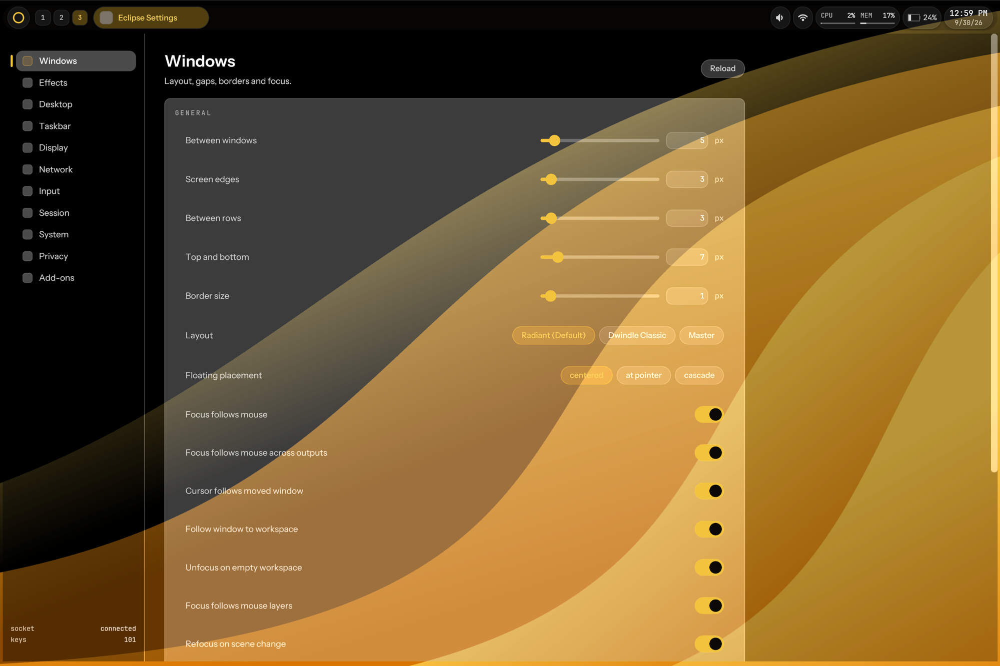
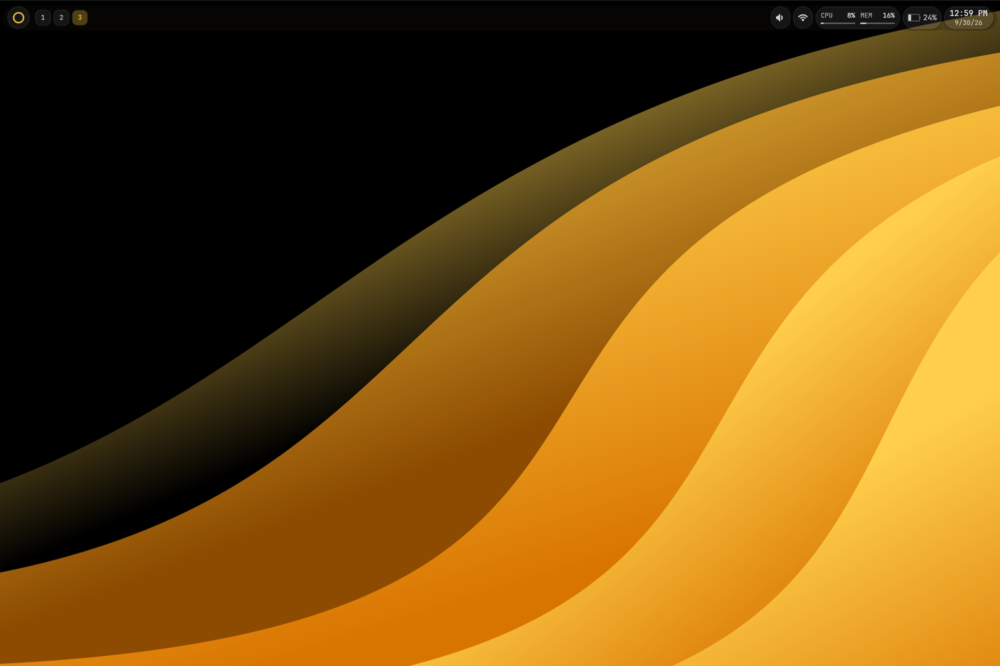
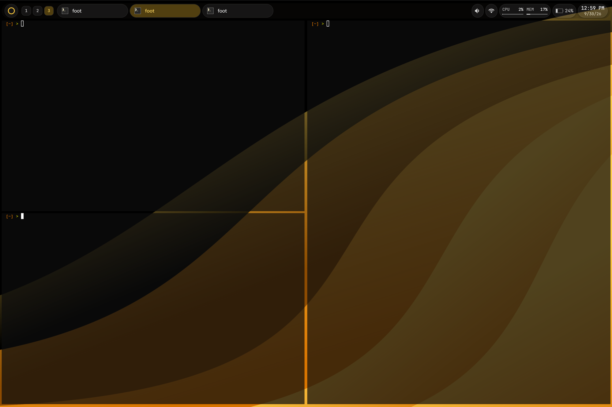

<p align="center">
  
</p>

> Hello, and welcome, to EclipseOS.  
> My gift to the world, my labor of love.  
> I have been working on EclipseOS since 8/28/2026, almost non-stop.  
> The goal of EclipseOS is not recognition, nor is it a quest to surpass others.  
> It is merely my attempt at making something other humans will like.  
> I truly, truly hope you enjoy.

<table>
  <tr>
    <td rowspan="2" width="60%"></td>
    <td width="40%"></td>
  </tr>
  <tr>
    <td></td>
  </tr>
</table>

## What is EclipseOS

EclipseOS is an Arch-based operating system built around **Abyss**, its own Wayland compositor written in Rust. The desktop is dark by default with a gold accent: translucent, blurred glass layers, rounded corners, soft depth and fluid motion.

Under the glass, a few things are different:

- **Agents get their own seats.** AI agents drive the desktop through a compositor-native protocol on their own input seats, so they never race or steal your focus, and everything they do is attributable.
- **No ambient authority.** Every agent action crosses a policy check first, and fails closed.
- **Trusted UI is drawn by the compositor**, above every app, so consent prompts can't be spoofed.
- **Your input is never logged by content.** Not in logs, not in the audit trail.

**Status:** early. The installer and desktop work, but EclipseOS is not a daily driver yet. [STATUS.md](docs/STATUS.md) lists what is verified and what is still stubbed.

## Install

**You will need:** a 64-bit UEFI PC, a USB stick (the ISO is a few GB), and an internet connection during install. Turn Secure Boot off; it isn't supported yet. The installer erases the disk you pick, so back up first.

1. **Download** the latest ISO from the [Releases page](https://github.com/chasebrowndev/EclipseOS/releases) (`eclipseos-YYYY.MM.DD-x86_64.iso`, plus its `.sig` and sha256).
   *(Release not published yet — this link goes live with the first ISO.)*
2. **Verify** it:
   ```
   sha256sum -c eclipseos-*.iso.sha256
   ```
3. **Write it to a USB stick.** Replace `/dev/sdX` with your stick (check with `lsblk`); everything on it is erased:
   ```
   sudo dd if=eclipseos-*.iso of=/dev/sdX bs=4M status=progress oflag=sync
   ```
   On Windows or macOS, use [balenaEtcher](https://etcher.balena.io/) or Rufus (DD mode).
4. **Boot from it.** Restart and open your firmware's boot menu (usually F12, F10, F2 or Esc) and choose the USB stick.
5. **The installer starts by itself.** It is graphical and walks you through the rest.

Once installed, updates arrive through the signed EclipseOS package repository with `pacman`.

Want to build the ISO yourself? See [D-03](docs/design/D-03-installation-media.md) and [BUILDING.md](docs/BUILDING.md).

## Learn more

| | |
|---|---|
| [Abyss compositor](abyss/README.md) | the window manager at the heart of EclipseOS |
| [STATUS.md](docs/STATUS.md) | what is built, stubbed and verified |
| [ARCHITECTURE.md](docs/ARCHITECTURE.md) | how the pieces fit together |
| [CONFIG.md](docs/CONFIG.md) | configuring the desktop |

## Licence

System code is **AGPL-3.0-only** ([LICENSE](LICENSE)). Protocol definitions and the agent SDKs are **Apache-2.0** ([LICENSE-APACHE](LICENSE-APACHE)). The name and logo are not licensed by the AGPL: [TRADEMARK.md](AbyssCompositor/TRADEMARK.md).
