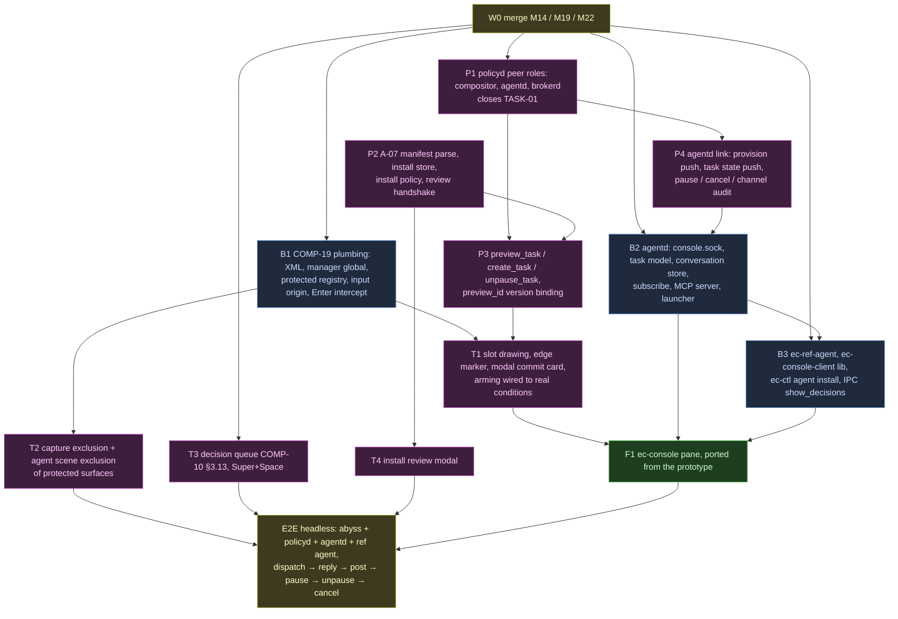

# Console wave: from a typed task to an agent's reply

Goal: the owner opens the console, types a task, presses physical Enter on the
compositor-drawn commit slot, an agent starts, replies in the conversation,
and the owner can answer, pause, cancel and unpause, all with the spec's
authority split intact (A-08 §1: the surface used constantly carries no
authority; the surface that carries authority draws its own pixels).

Governing text: A-08 (VOL2 4362), COMP-19 (VOL2 4862), A-07 §2–§5 (VOL2 4159),
A-02, A-03, COMP-10 §3.12–§3.13 (Appendix F-11, F-12), F-05 (input origin),
F-13 (audit kinds).

## Out of scope this wave, and why

| Item | Why not now | What the console shows instead |
|---|---|---|
| Resume a session (A-08 §5.4) | Needs `session.restore()` (A-06) and the I-02 inference path that writes session records; neither exists | History entries offer **Start fresh** and **Delete**; Resume is absent, not faked |
| A model-backed agent | No I-02 router | The reference agent (`ec-ref-agent`) answers mechanically |
| Attachments (A-08 §14.1) | Open decision, v1.1 | — |
| Full M25 MCP catalog | M25 exit gate is its own wave | MCP carries `task.say`, `task.ask`, `task.inbox` plus `initialize`/`tools/list` |
| Activity lens link (ADR 0066) | Fog does not exist | Absent |
| Install-time narrowing UI | Review modal ships approve/refuse only | Narrowed set is the full requested set or nothing |

## Graph



Purple is the main thread (TCB), blue the backend agent, green the frontend
agent. B1, B2, B3 and P1–P4 run at the same time against the contracts below;
nothing in a later box changes a contract silently.

## Contracts

### C1. policyd link, compositor role (ec-policy-eval `link.rs`)

Canonical CBOR, tagged by `m`, as today.

| Direction | Tag | Fields | Notes |
|---|---|---|---|
| → | `preview_task` | `req`, `slot`, `package`, `statement`, `deadline`, `narrowing` (bytes), `continuation` | `deadline` ms, 0 = package default |
| ← | `preview` | `req`, `preview`, `display` (bytes) | `display` is the canonical CBOR of [`SlotDisplay`](#slotdisplay) |
| ← | `refused` | `req`, `reason` | reason code, never a rule id |
| → | `create_task` | `req`, `slot`, `preview` | |
| ← | `task_created` | `req`, `task` (text) | |
| ← | `refused` | `req`, `reason` | `preview_stale` re-previews |
| → | `unpause_task` | `req`, `slot`, `task` | human pauses only (A-08 §14.5) |
| ← | `done` / `refused` | `req`, `reason?` | |
| → | `install_begin` | `req`, `path` | from `ec-ctl agent install` via the human socket |
| ← | `install_review` | `req`, `review`, `display` (bytes) | |
| → | `install_answer` | `review`, `approve` | |
| ← | `done` / `refused` | `req`, `reason?` | |
| ← | `task_state` | `task`, `state`, `reason` | broadcast; abyss drops slots for closed tasks |

`preview` is a policyd-chosen u64, bound to (draft bytes, table version,
install-policy version, the exact capability set). `create_task` mints that
capability set verbatim or refuses `preview_stale`.

#### SlotDisplay

What the slot draws (F-11), every string already sanitised by policyd:
`package_name`, `publisher`, `statement`, `deadline_ms`, `taxonomies`
(text list, phrased as possibility, A-07 §9.2), `narrowed` (bool),
`continuation` (text or empty), `untrusted_predecessor` (bool).

### C2. policyd link, agentd role

| Direction | Tag | Fields |
|---|---|---|
| ← | `provision` | `task`, `principal`, `package`, `version`, `statement`, `deadline`, `grant` (COSE), `continuation` |
| ← | `task_state` | `task`, `state` (`active`/`paused`/`draining`/`closed`), `reason` |
| → | `pause_task` | `req`, `task` |
| → | `cancel_task` | `req`, `task`, `mode` (`drain`/`immediate`) |
| → | `exited` | `req`, `task`, `reason` (`completed`/`failed`) |
| ← | `done` / `refused` | `req`, `reason?` |
| → | emission | `channel` audit records (message id, size, chain hash; never the body) |

policyd provisions only while an agentd connection is live (A-01 §5,
A-08 §12); with none, `create_task` refuses `agentd_unavailable` at preview.

### C3. Peer roles (P1)

policyd classifies each connection once, at accept (`ec-policyd/src/peer.rs`):
the `SO_PEERCRED` pid's `/proc/<pid>/exe` must be `/usr/bin/ec-abyss`
(`compositor`), `/usr/bin/ec-agentd` (`agentd`) or `/usr/bin/ec-brokerd`
(`brokerd`), and its cgroup must not be under `agents.slice`. Anything else
is refused. Each role may send only its own messages and emit only the kinds
it witnesses. The `dev-peers` feature accepts the same names from any
directory; the package build never enables it. Not the F-05 unit check,
because the compositor must stay in its logind session scope (KNOWNBUGS
TASK-01).

### C4. `eclipse_protected_surface_v1` (B1)

Exactly COMP-19 §2. Server in `protocols/protected/`. abyss state:
`protected: Protected { surfaces, slots }`, handle-based. The slot object
holds the draft and calls a TCB hook `trusted_ui::slot::on_draft(state, slot)`
(debounced to 10/s) and `on_enter(state, slot, now)`; the hooks are
main-thread code. `geometry` is answered from `trusted_ui::slot::size()`.

Input origin (F-05): `enum Origin { Physical, AgentSeat, AgentCompat,
Virtual, Scripted, Injected }` carried on every event from creation to
delivery. Delivery to a protected surface or any of its subsurfaces drops
everything but `Physical` (and `Injected` under the `wlcs` feature, compiled
out of release), counts it for `input_refused` (≤ 1/s), and audits agent
origins (`input_refused` record, F-13).

### C5. console.sock (B2)

A-08 §7 exactly: line-delimited JSON-RPC 2.0, `$XDG_RUNTIME_DIR/eclipse/console.sock`,
0600, owner uid, refused when the peer cgroup is under `agents.slice`.
Errors follow COMP-13 §2 codes; a task id that is not the owner's, or does not
exist, answers the same `not_found`. Event payloads:

```
task_started     {task_id, package, statement, deadline_ms}
task_state       {task_id, state, reason}
message          {task_id, msg_id, kind, text, reply_to?, trust: {min_trust, head}}
awaiting_reply   {task_id, awaiting}
decisions_pending{count}
task_closed      {task_id, reason}
```

`show_decisions` and `decisions_pending` go through abyss's human socket
(`show_decisions` method, `decisions_pending` event).

### C6. MCP (B2 server, B3 client)

Per task, `$XDG_RUNTIME_DIR/eclipse/agents/<task_id>/mcp.sock`, bind-mounted
into the sandbox as the only socket. Line-delimited JSON-RPC 2.0, MCP
`initialize`, `tools/list`, `tools/call`. Tools: `task.say {text}`,
`task.ask {question}`, `task.inbox {since?}` (A-08 §6, F-04). Quotas per A-03 §7.

## Exit check for this wave

1. A same-uid script with every socket cannot create, unpause or resume a task
   (A-08 §13 "No task without a slot"; also C3).
2. An agent with `seat.key`/`seat.pointer` cannot type into the composer, press
   the slot, or see the console (A-08 §13, COMP-19 §9 origin matrix).
3. Shown = submitted across randomized drafts; a stale preview refuses and
   re-arms (A-08 §13).
4. Headless E2E: dispatch → `task_started` → ref agent `task.say` → console
   `message` → human `conversation_post` → agent `task.inbox` sees it with
   `standard` trust → pause → unpause slot → cancel drain → `task_closed`.
5. The console pane passes the frontend agent's screenshot loop against
   `docs/STYLE.md`, and renders no decision content (A-08 §4.1).
