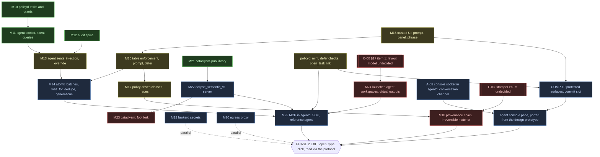

# Phase 2 backend: what is left, and in what order

Status as of 2026-10-06 (branch `claude/gifted-pasteur-ob6uoi`). Milestones
are VOL1's COMP-16 table; `docs/STATUS.md` has the detail.

## Work order

| Wave | Item | Who | Why now |
|---|---|---|---|
| A1 | M14: generations, dedupe, atomic batches, `wait_for`, `compat_lock` | backend agent, TCB parts main | unblocks M25; finishes the seat protocol |
| A2 | M16 remainder: golden decision suite (both evaluators), fault-injection no-mutation suite, ≤50 µs bench | main (TCB) | the M16 exit gate |
| A3 | M17: `classify`/`trust` compiled into the table, class recompute on title/url change, race suite; retire the manual flag | main (TCB) | default policy cannot classify anything until this lands |
| A4 | M13/M15 suite gaps: X11 posture, trusted-UI suite (agent seat cannot answer a prompt) | main | exit gates of done-ish milestones |
| B1 ∥ | ~~M21 `cataclysm-pub`~~: already in the tree since the workspace split; STATUS had it as not started | — | done; needs owner review |
| B2 ∥ | M19 `brokerd` (S-08): sealed store, injection modes; TPM mocked here | backend agent | separable; real TPM is a hardware check |
| B3 ∥ | M20 egress proxy (S-09) | backend agent, if the container can create netns | separable; may need the dev host |
| C1 | `policyd`: mint from prompt answers, deterministic defer checks, `open_task`/`close_task` on the link | main (TCB) | done except the chain-reading defer predicates (M18); a task CLI was built and removed, since A-08 §7 forbids one |
| C2 | M22 `eclipse_semantic_v1` server | backend agent | after M21 |
| C3 | M25 MCP surface in `agentd`, reference agent | backend agent | after M14 and C1; the Phase 2 exit demo |
| D1 | COMP-19 `eclipse_protected_surface_v1`: protected panes, commit slot (preview → arm → physical Enter → `create_task`), capture exclusion, human-only input | backend agent for protocol plumbing; slot, capture and policyd preview are main (TCB) | the only legal way a task is created (A-08 §5.2); closes TASK-01 |
| D2 | A-08 §6–7: `console.sock` in `agentd`, `conversation/<task_id>` channel, `list_tasks`, `subscribe`, `cancel_task` drain/immediate | backend agent; policyd task feed is main | the console's data source |
| D3 | Agent console pane (`shell/crates/ec-console`), ported from the design prototype | frontend agent | after D1 and D2 |
| — | M18, M23, M24 | blocked | spec decisions (F-03, C-00 §17) and a C fork |

The agent console prototype is in (scratchpad; not committed, 17 MB bundle).
It matches A-08 and COMP-19: the composer, the decision queue and the resume
card are compositor-drawn holes, and the console itself talks only to
`agentd`'s `console.sock`.
